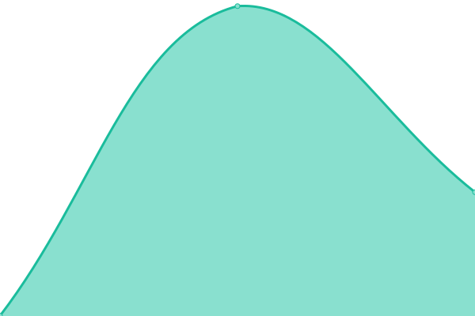
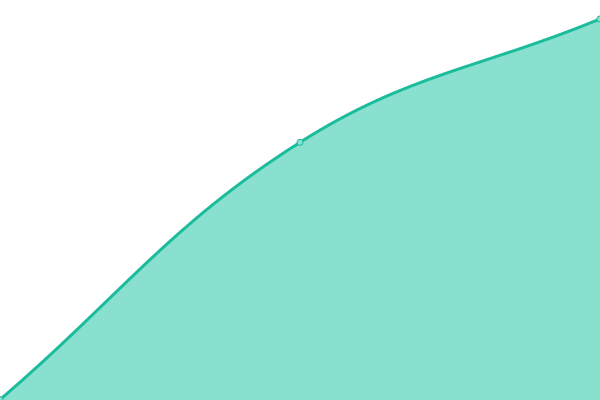
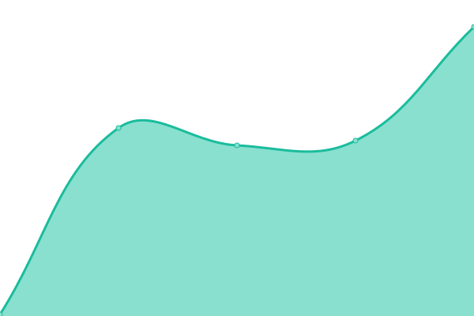
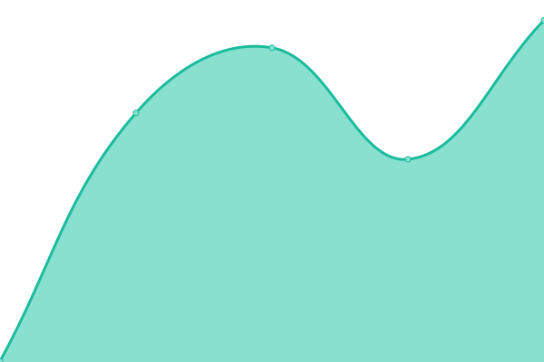

# [📈 Live Status](https://sebsteinig.github.io/uptime-dashboard): <!--live status--> **🟩 All systems operational**

This repository contains the open-source uptime monitor and status page for [Sebastian Steinig](sebsteinig.github.io), powered by [Upptime](https://github.com/upptime/upptime).

With [Upptime](https://upptime.js.org), you can get your own unlimited and free uptime monitor and status page, powered entirely by a GitHub repository. We use [Issues](https://github.com/sebsteinig/uptime-dashboard/issues) as incident reports, [Actions](https://github.com/sebsteinig/uptime-dashboard/actions) as uptime monitors, and [Pages](https://sebsteinig.github.io/uptime-dashboard) for the status page.

<!--start: status pages-->
<!-- This summary is generated by Upptime (https://github.com/upptime/upptime) -->
<!-- Do not edit this manually, your changes will be overwritten -->
<!-- prettier-ignore -->
| URL | Status | History | Response Time | Uptime |
| --- | ------ | ------- | ------------- | ------ |
|  [Methane Explorer (PROD)](https://apps.atmosphere.copernicus.eu/methane-explorer/) | 🟩 Up | [methane-explorer-prod.yml](https://github.com/sebsteinig/uptime-dashboard/commits/HEAD/history/methane-explorer-prod.yml) | 

 1098ms
     
 | 

<a href="https://sebsteinig.github.io/uptime-dashboard/history/methane-explorer-prod">100.00%</a>
    

|  [Methane Explorer (DEV)](https://apps.copernicus-climate.eu/methane-explorer/) | 🟩 Up | [methane-explorer-dev.yml](https://github.com/sebsteinig/uptime-dashboard/commits/HEAD/history/methane-explorer-dev.yml) | 

 958ms
     
 | 

<a href="https://sebsteinig.github.io/uptime-dashboard/history/methane-explorer-dev">100.00%</a>
    

|  [vAirify](http://64.225.143.231/city/summary) | 🟩 Up | [v-airify.yml](https://github.com/sebsteinig/uptime-dashboard/commits/HEAD/history/v-airify.yml) | 

 267ms
     
 | 

<a href="https://sebsteinig.github.io/uptime-dashboard/history/v-airify">100.00%</a>
    

|  [Fire Watch](https://apps.atmosphere.copernicus.eu/fire-watch/) | 🟩 Up | [fire-watch.yml](https://github.com/sebsteinig/uptime-dashboard/commits/HEAD/history/fire-watch.yml) | 

 130ms
     
 | 

<a href="https://sebsteinig.github.io/uptime-dashboard/history/fire-watch">5.13%</a>
    

|  [GFAS API Health](https://apps.atmosphere.copernicus.eu/gfas/api/api/health/) | 🟩 Up | [gfas-api-health.yml](https://github.com/sebsteinig/uptime-dashboard/commits/HEAD/history/gfas-api-health.yml) | 

 147ms
     
 | 

<a href="https://sebsteinig.github.io/uptime-dashboard/history/gfas-api-health">100.00%</a>
    

|  [Zarr Globe](https://apps.atmosphere.copernicus.eu/zarr-globe) | 🟩 Up | [zarr-globe.yml](https://github.com/sebsteinig/uptime-dashboard/commits/HEAD/history/zarr-globe.yml) | 

 255ms
     
 | 

<a href="https://sebsteinig.github.io/uptime-dashboard/history/zarr-globe">100.00%</a>
    

|  [Climate Archive](https://climatearchive.org) | 🟩 Up | [climate-archive.yml](https://github.com/sebsteinig/uptime-dashboard/commits/HEAD/history/climate-archive.yml) | 

 383ms
     
 | 

<a href="https://sebsteinig.github.io/uptime-dashboard/history/climate-archive">100.00%</a>
    

|  [Climate Archive API](https://api.climatearchive.org:8443/getData?lat=37.10&lon=9.5&model=tfksu) | 🟩 Up | [climate-archive-api.yml](https://github.com/sebsteinig/uptime-dashboard/commits/HEAD/history/climate-archive-api.yml) | 

 459ms
     
 | 

<a href="https://sebsteinig.github.io/uptime-dashboard/history/climate-archive-api">100.00%</a>
    

<!--end: status pages-->

[**Visit our status website →**](https://sebsteinig.github.io/uptime-dashboard)

## 📄 License

- Powered by: [Upptime](https://github.com/upptime/upptime)
- Code: [MIT](./LICENSE) © [Anand Chowdhary](https://anandchowdhary.com), supported by [Pabio](https://pabio.com)
- Data in the `./history` directory: [Open Database License](https://opendatacommons.org/licenses/odbl/1-0/)
