# [📈 Live Status](https://sebsteinig.github.io/uptime-dashboard): <!--live status--> **🟧 Partial outage**

This repository contains the open-source uptime monitor and status page for [Sebastian Steinig](sebsteinig.github.io), powered by [Upptime](https://github.com/upptime/upptime).

With [Upptime](https://upptime.js.org), you can get your own unlimited and free uptime monitor and status page, powered entirely by a GitHub repository. We use [Issues](https://github.com/sebsteinig/uptime-dashboard/issues) as incident reports, [Actions](https://github.com/sebsteinig/uptime-dashboard/actions) as uptime monitors, and [Pages](https://sebsteinig.github.io/uptime-dashboard) for the status page.

<!--start: status pages-->
<!-- This summary is generated by Upptime (https://github.com/upptime/upptime) -->
<!-- Do not edit this manually, your changes will be overwritten -->
<!-- prettier-ignore -->
| URL | Status | History | Response Time | Uptime |
| --- | ------ | ------- | ------------- | ------ |
|  [Methane Explorer (PROD)](https://apps.atmosphere.copernicus.eu/methane-explorer/) | 🟩 Up | [methane-explorer-prod.yml](https://github.com/sebsteinig/uptime-dashboard/commits/HEAD/history/methane-explorer-prod.yml) | 

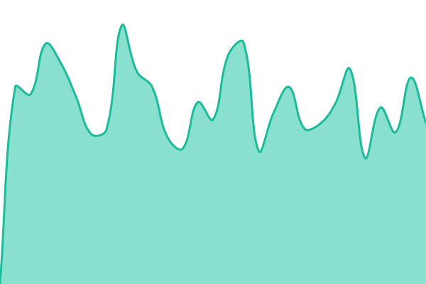 588ms
     
 | 

<a href="https://sebsteinig.github.io/uptime-dashboard/history/methane-explorer-prod">100.00%</a>
    

|  [CAMS Data Sites (sites.ecmwf.int)](https://sites.ecmwf.int/data/cams/) | 🟩 Up | [cams-data-sites.yml](https://github.com/sebsteinig/uptime-dashboard/commits/HEAD/history/cams-data-sites.yml) | 

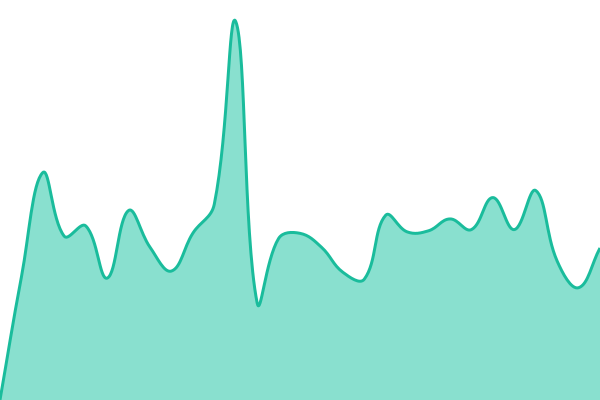 1183ms
     
 | 

<a href="https://sebsteinig.github.io/uptime-dashboard/history/cams-data-sites">100.00%</a>
    

|  [vAirify (dashboard)](http://64.225.143.231/city/summary) | 🟩 Up | [v-airify-dashboard.yml](https://github.com/sebsteinig/uptime-dashboard/commits/HEAD/history/v-airify-dashboard.yml) | 

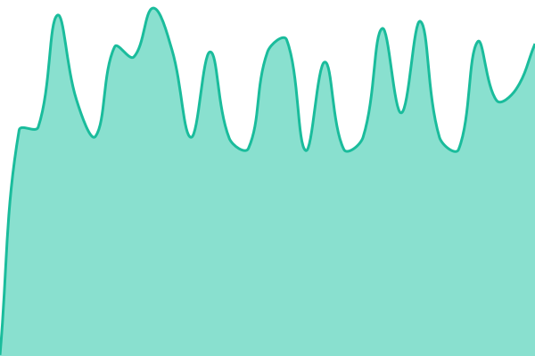 267ms
     
 | 

<a href="https://sebsteinig.github.io/uptime-dashboard/history/v-airify-dashboard">100.00%</a>
    

|  [vAirify (API)](http://64.225.143.231/api/air-pollutant/measurements?date_from=2026-03-02T12:00:00.000Z&date_to=2026-03-03T12:00:00.000Z&location_type=city&location_names=Brussels) | 🟩 Up | [vairify-measurements-api.yml](https://github.com/sebsteinig/uptime-dashboard/commits/HEAD/history/vairify-measurements-api.yml) | 

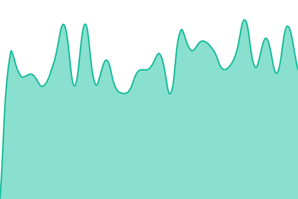 982ms
     
 | 

<a href="https://sebsteinig.github.io/uptime-dashboard/history/vairify-measurements-api">100.00%</a>
    

|  [Fire Watch (website)](https://apps.atmosphere.copernicus.eu/fire-watch/) | 🟥 Down | [fire-watch-website.yml](https://github.com/sebsteinig/uptime-dashboard/commits/HEAD/history/fire-watch-website.yml) | 

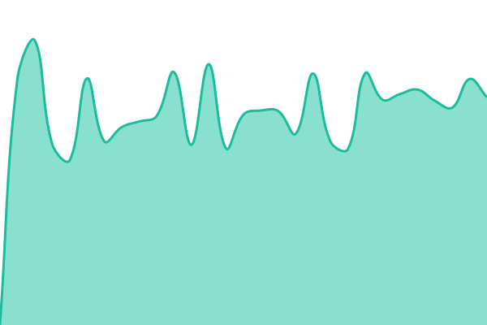 1155ms
     
 | 

<a href="https://sebsteinig.github.io/uptime-dashboard/history/fire-watch-website">0.00%</a>
    

|  [GFAS (API)](https://apps.atmosphere.copernicus.eu/gfas/api/api/anomalies/?variable=cfire&start_date=2026-01-01&end_date=2026-01-31&adm0=ALL&all_years=true&aggregation=SUM&timeout=120) | 🟩 Up | [gfas-api.yml](https://github.com/sebsteinig/uptime-dashboard/commits/HEAD/history/gfas-api.yml) | 

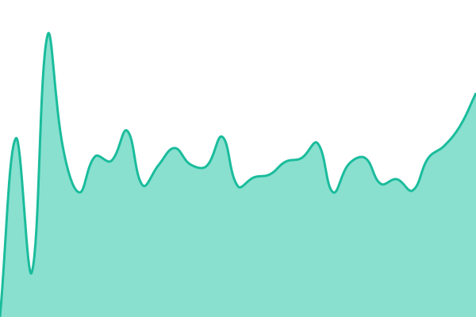 1435ms
     
 | 

<a href="https://sebsteinig.github.io/uptime-dashboard/history/gfas-api">100.00%</a>
    

|  [Methane Explorer (DEV)](https://apps.copernicus-climate.eu/methane-explorer/) | 🟩 Up | [methane-explorer-dev.yml](https://github.com/sebsteinig/uptime-dashboard/commits/HEAD/history/methane-explorer-dev.yml) | 

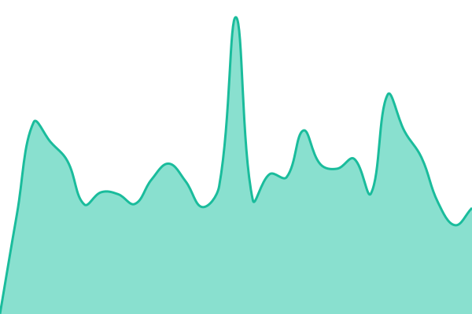 783ms
     
 | 

<a href="https://sebsteinig.github.io/uptime-dashboard/history/methane-explorer-dev">100.00%</a>
    

|  [Zarr Globe (website)](https://apps.atmosphere.copernicus.eu/zarr-globe) | 🟩 Up | [zarr-globe-website.yml](https://github.com/sebsteinig/uptime-dashboard/commits/HEAD/history/zarr-globe-website.yml) | 

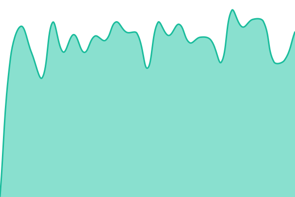 981ms
     
 | 

<a href="https://sebsteinig.github.io/uptime-dashboard/history/zarr-globe-website">100.00%</a>
    

|  [Climate Archive (website)](https://climatearchive.org) | 🟩 Up | [climate-archive-website.yml](https://github.com/sebsteinig/uptime-dashboard/commits/HEAD/history/climate-archive-website.yml) | 

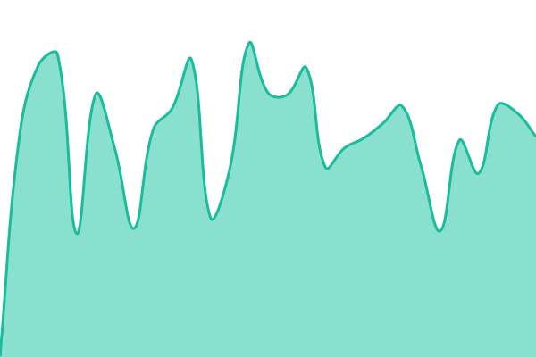 566ms
     
 | 

<a href="https://sebsteinig.github.io/uptime-dashboard/history/climate-archive-website">100.00%</a>
    

|  [Climate Archive (Java API)](https://api.climatearchive.org:8443/getData?lat=37.10&lon=9.5&model=tfksu) | 🟥 Down | [climate-archive-java-api.yml](https://github.com/sebsteinig/uptime-dashboard/commits/HEAD/history/climate-archive-java-api.yml) | 

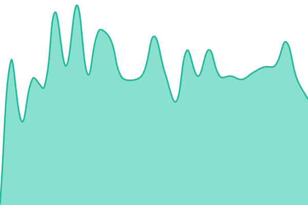 0ms
     
 | 

<a href="https://sebsteinig.github.io/uptime-dashboard/history/climate-archive-java-api">0.00%</a>
    

|  [Climate Archive (Flask API)](https://data.climatearchive.org/api/get_ts_data_cmip) | 🟩 Up | [climate-archive-flask-api.yml](https://github.com/sebsteinig/uptime-dashboard/commits/HEAD/history/climate-archive-flask-api.yml) | 

 512ms
     
 | 

<a href="https://sebsteinig.github.io/uptime-dashboard/history/climate-archive-flask-api">100.00%</a>
    

|  [GPlates Reconstruct (API)](https://gws.gplates.org/reconstruct/reconstruct_points/?lats=49&lons=6&times=102.6,97.2,91.9,86.7,80.8,75,69,66,61,56,51.9,44.5,39.5,35.9,31,25.6,19.5,14.9,10.5,3.1,0) | 🟩 Up | [gplates-reconstruct-api.yml](https://github.com/sebsteinig/uptime-dashboard/commits/HEAD/history/gplates-reconstruct-api.yml) | 

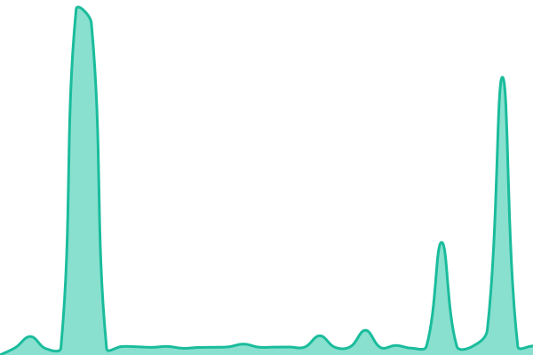 5693ms
     
 | 

<a href="https://sebsteinig.github.io/uptime-dashboard/history/gplates-reconstruct-api">90.90%</a>
    

<!--end: status pages-->

[**Visit our status website →**](https://sebsteinig.github.io/uptime-dashboard)

## 📄 License

- Powered by: [Upptime](https://github.com/upptime/upptime)
- Code: [MIT](./LICENSE) © [Anand Chowdhary](https://anandchowdhary.com), supported by [Pabio](https://pabio.com)
- Data in the `./history` directory: [Open Database License](https://opendatacommons.org/licenses/odbl/1-0/)
